AWS 프로젝트 1주차
===

1. AWS IAM USER 생성 및 MFA 설정
2. VPC 구축
3. Bastion host 생성
---
## 1. AWS IAM USER 생성 및 MFA 설정
### IAM
 - AWS 리소스에 대한 액세스를 안전하게 제어할 수 있는 웹 서비스. 
 - IAM을 사용하여 리소스를 사용하도록 인증(로그인) 및 권한 부여(권한 있음)된 대상을 제어.
 - 보안 상 root 계정 사용 하지 않음.

 ### MFA
 - 보안 강화를 위해 계정과 개별 사용자에게 2팩터 인증을 추가
 - 암호나 액세스 키 외에 특별 구성된 디바이스의 코드 제공해야함.

---
### IAM USER 생성
1. IAM 서비스 > 사용자 > 사용자 추가   
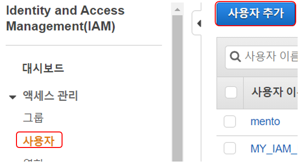</img><br/>      
   
<br></br>

2. 사용자 세부 정보 설정
- AWS Management Console 액세스 선택
- 첫 접속 시 비밀번호 변경하도록 설정   
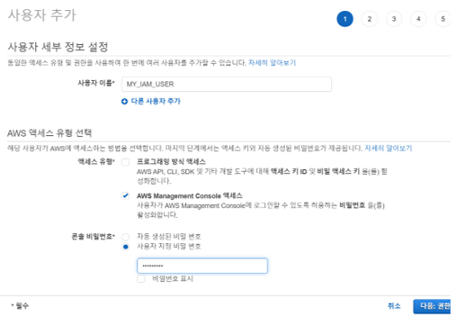</img><br/>

<br><br>

3. 권한 설정 > 그룹 생성 > AdministratorAccess 그룹 > 그룹에 사용자 추가
- Admin 권한은 되도록 주지 않는 것이 좋다.
- 태그 설정은 여러 프로젝트가 있을 때 하는 것이 좋다.   
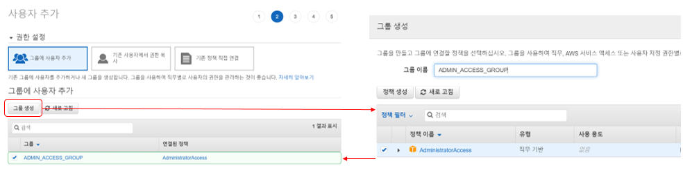</img><br/>

---
### MFA 설정
1. Google OTP을 예제로 사용할 것이다.
2. IAM 계정 > 내 보안 자격 증명 > MFA 디바이스 할당 > 가상 MFA 디바이스
3. Google OTP 앱 에서 연속된 MFA 코드 입력 후 할당    
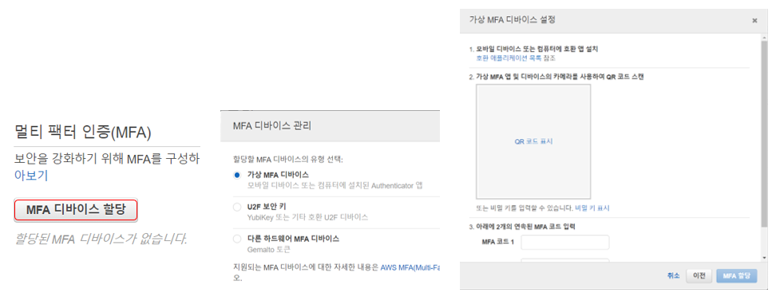</img><br/>

---
---
## 2. VPC 구축
### VPC
- 다른 가상 네트워크와 논리적으로 분리된 전용 가상 네트워크
- 서브넷 : VPC의 IP 주소 범위
- 라우팅 테이블 : 네트워크 트래픽을 전달할 위치를 결정하는 데 사용되는 라우팅 규칙 집합
- 인터넷 게이트웨이 : VPC 내의 리소스와 인터넷 간 통신을 활성화하기 위한 게이트웨이
- VPC 엔드포인트 : 인터넷 게이트웨이, NAT 디바이스, VPN 연결 또는 AWS Direct Connect 연결을 필요로 하지 않고 PrivateLink 구동 지원 AWS 서비스 및 VPC 엔드포인트 서비스에 VPC를 비공개로 연결할 수 있습니다. VPC의 인스턴스는 서비스의 리소스와 통신하는 데 퍼블릭 IP 주소를 필요로 하지 않습니다. VPC와 기타 서비스 간의 트래픽은 Amazon 네트워크를 벗어나지 않습니다.
---
### VPC 생성
1. VPC CIDR 범위를 10.0.0.0/16으로 사용 할 것이다.   
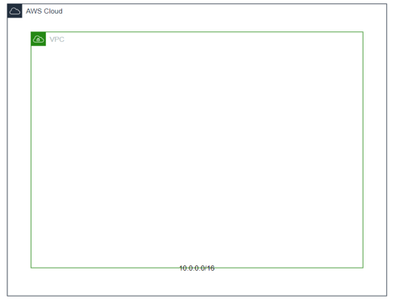</img><br/>

2. VPC > VPC 생성 > VPC 설정
3. DNS 호스트 이름 활성화 : VPC 내부에 생성되는 인스턴스에 public DNS 할당   
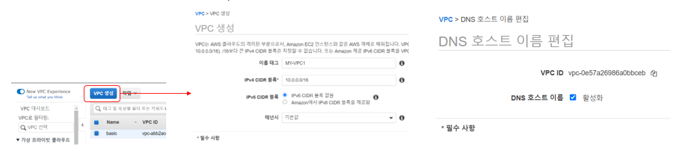</img><br/>

---
### Subnet 생성
1. VPC CIDR 블록 범위 내에서 CIDR 블록 단위를 나누어 더 많은 네트워크 망을 만든다.
2. 인터넷과 연결되는 Public망과 그렇지 않은 Private망이 있다.
3. 다음과 같은 Subnet CIDR 을 사용할 것이다.      
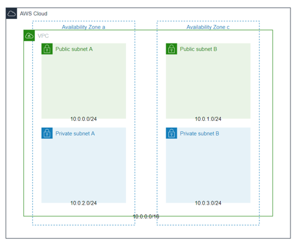</img><br/>

4. VPC > 서브넷 > 서브넷 생성 > 서브넷 설정      
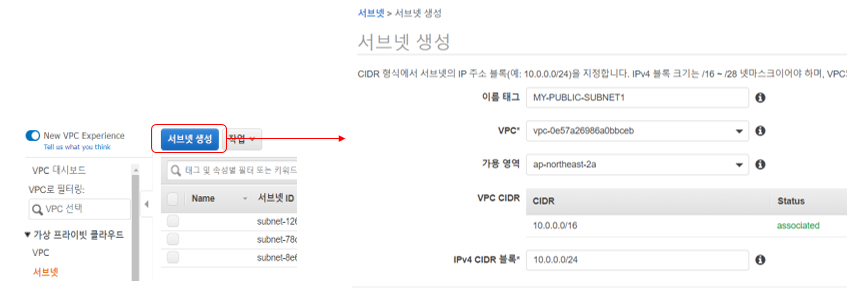</img><br/>

---
### 인터넷 게이트 웨이 생성
1. VPC안의 리소스들이 인터넷과 통신하기 위한 게이트웨이
2. VPC > 인터넷 게이트웨이 > 인터넷 게이트웨이 생성 > VPC 연결    
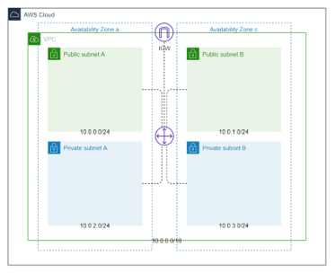</img><br/>    
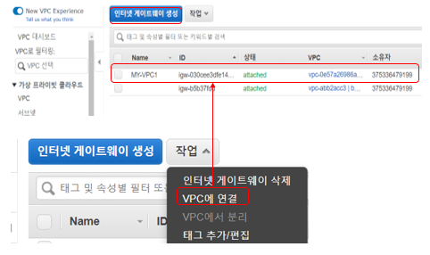</img><br/>

---
### Public Subnet 라우팅 테이블 생성
1. VPC > 라우팅 테이블 > 라우팅 테이블 (external-router) 생성
2. 서브넷 연결 > 서브넷 연결 편집 > Public Subnet A, B 연결
3. 인터넷 게이트웨이가 외부로의 라우팅 역할을 하도록 추가   
대상 : 0.0.0.0/0 대상 : 인터넷 게이트웨이    
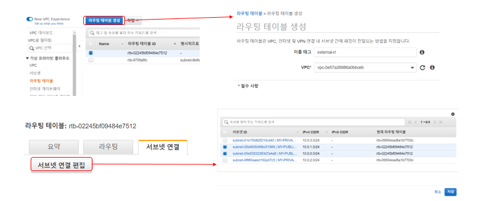</img><br/>    
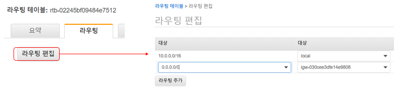</img><br/>

---
### Private Subnet 라우팅 테이블 생성
1. VPC > 라우팅 테이블 > 라우팅 테이블 (internal-router) 생성
2. 서브넷 연결 > 서브넷 연결 편집 > Private Subnet A,B 연결    
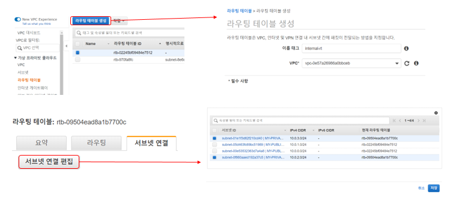</img><br/>

---
---
## Bastion Host 생성
### Bastion Host 생성   
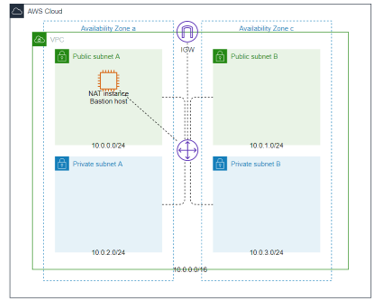</img><br/>    
1. 내부와 외부 네트워크 사이에서 게이트 역할을 하는 Host/Public IP 부여
2. NAT 게이트웨이 비용 문제로 대체 역할
3. 세부 사항   
- 이미지 : amzn_ami-vpc-nat-hvm-2017.09.1-testlongids.20180307-x86_64-ebs    
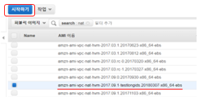</img><br/>

- 인스턴스 유형 : t2.micro    
</img><br/>

- 네트워크 : 생성한 VPC   
- 서브넷 : Public Subnet A     
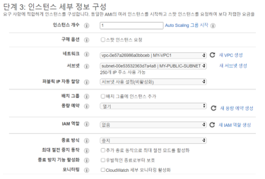</img><br/>

- 스토리지 : gp2, 8GB   
- 보안그룹 : SSH 포트 오픈    
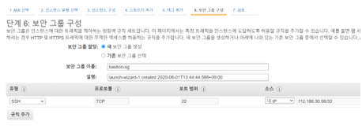</img><br/>

- 키페어 생성 > 초기에 인스턴스에 접근하기 위해 필요
    - putty 사용을 위해 *.pem 을 *.ppk로 변환
4. NAT 인스턴스로 동작하기 위해 라우팅 테이블에 Internal-router 추가    
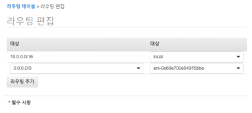</img><br/>

5. 소스/대상 확인 변경    
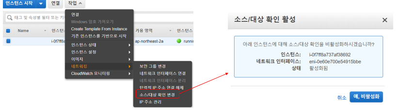</img><br/>

6. Elastic IP 부여 > 외부에서 접근 가능하도록    
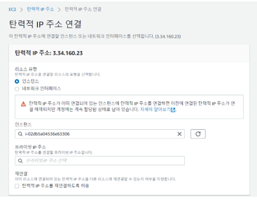</img><br/>

---
### OS 계정 생성과 sudo 권한 부여 및 패스워드 로그인 허용
1. 보안 상의 이유로 ec2-user 사용하지 않을 것이며, key 방식 로그인을 지양
2. 계정 생성
```
sudo adduser admin
sudo passwd admin
```
3. sudo 권한 부여
- /etc/sudoers를 직접 수정하는 것은 권장하지 않는다.
- /etc/sudoers.d/cloud-init에 사용자 추가
```
sudo chmod 640 /etc/sudoes.d/cloud-init
sudo vi /etc/sudoers.d/cloud-init
```
```
(userid) ALL = ALL // 추가

# User rules for ec2-user
(userid) ALL =(ALL) ALL //추가
```
```
sudo chmod 440 /etc/sudoers.d/cloud-init
```

4. 패스워드 로그인 설정
- /etc/ssh/sshd_config 파일 설정
```
# EC2 uses keys for remote access
PasswordAutehntication yes
.
.
PubkeyAuthentication no
```
```
service sshd restart
```