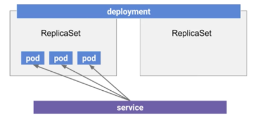

AWS 프로젝트 2주차
===

1. 쿠버네티스
2. EKS 환경 구성
3. Nginx 서비스 배포
---
### 쿠버네티스
1. 쿠버네티스
    - 컨테이너화된 애플리케이션의 자동 디플로이, 스케일링 등을 제공하는 컨테이너 오케스트레이션 툴
    - 여러 클러스터의 호스트 간에 애플리케이션 컨테이너의 배치, 스케일링, 운영을 자동화하기 위한 플랫폼

2. 쿠버네티스 클러스터 아키텍처
    1) 쿠버네티스 컨트롤 플레인
        - 컨테이너의 라이플 사이클을 정의, 배포, 관리하기 위한 API와 인터페이스들을 노출하는 컨테이너 오케스트레이션 레이어
        - etcd, API 서버, 스케줄러, 컨트롤러 매니저, 클라우드 컨트롤러 매니저 등 다양한 컴포넌트로 구성
        - 이러한 컴포넌트를 실행하는 호스트 > 마스터
    2) 쿠버네티스 노드
        - 컨테이너를 파드 내에 배치하고 실행하는 워크로드
        - kubelet, 컨테이너 런타임, kube-proxy 등 컴포넌트로 구성   
        </img><br/>

 3. 쿠버네티스 오브젝트
    1) 쿠버네티스는 상태를 관리하기 위한 대상을 오브젝트로 정의
    2) Pod : 애플리케이션의 기본 실행 단위, 하나 이상의 컨테이너로 구성
    3) Deployment : 애플리케이션 배포의 기본 단위
    4) Service : 하나의 논리적인 파드 셋과 그 파드들에 접근할 수 있는 정책을 정의
        - ClusterIP, NodePort, LoadBalancer, ExternalName 타입이 있다.   
    </img><br/>
    
---
---
### EKS 환경 구성
1. Bastion Host에 kubectl 설치
    - Bastion Host를 kubectl 명령어 수행하는 workspace로 사용

    ```
    $ curl -LO https://storage.googleapis.com/kubernetes-release/release/v1.18.0/bin/linux/amd64/kubectl
    $ chmod +x ./kubectl  // 실행권한 추가
    $ sudo mv ./kubectl /usr/local/bin/kubectl  //PATH 설정된 디렉토리
    $ kubectl version --client  //설치 버전 확인
    ```

    - 참고 : kubectl 자동완성
    ```
    $ yum install bash-completion   //bash-completion 설치
    $ echo 'source <(kubectl completion bash)' >>~/.bashrc
    $ kubectl completion bash > /etc/bash_completion.d/kubectl
    $ echo 'alias k=kubectl' >>~/.bashrc          
    $ echo 'complete -F __start_kubectl k' >>~/.bashrc   //alias추가
    reboot 후 적용 시 tab으로 자동완성 가능


2. EKS 클러스터 역할 생성
    - EKS 클러스터에 접근하기 위한 권한
    - IAM > 역할 > 역할 만들기
        - 이름 : eksClusterRole
        - 정책 : AmazonEKSClusterPolicy, AmazonEKSServicePolicy   

    </img><br/>

3. EKS 클러스터 보안 그룹 생성
    - 이름 : mission-cluster-sg
    - CloudFormation으로 노드그룹 생성 시 WorkerNode 보안그룹에 대한 규칙이 자동으로 생성된다.
    - EKS 클러스터 생성 시 EndPointAccess를 Private으로 설정 시 클러스터에 접근할 workspace 호스트에 대한 규칙도 추가 해야한다.   
    </img><br/>


4. EKS 클러스터 생성
    - AWS CLI를 사용하여 EKS 클러스터를 생성할 것이다.
    - 세부사항
        - 이름 : mission-cluster
        - 버전 : 1.14
        - 클러스터 서비스 역할 : IAM에서 생성한 역할 (eksClusterRole)
        - VPC : 생성한 VPC
        - Subnet : 생성한 Subnet 모두
        - SecurityGroup : 생성한 sg (mission-cluster-sg)

    ```
    $ aws eks create-cluster \   
    --region ap-northeast-2 \   
    --name mission-cluster \
    --kubernetes-version 1.14 \
    --role-arn (클러스터 서비스 역할의 ARN) \
    --resources-vpc-config subnetIds=[(Subnets ID)],securityGroupIds=[SecurityGroup ID]

    $ aws eks --region ap-northeast-2 update-kubeconfig --name mission-cluster  //kubeconfig 파일 업데이트
    ```

5. NodeGroup 생성
    - CloudFormation으로 WorkerNodeGroup 생성할 것이다.

    1) CloudFormation > 스택 생성 > 준비된 템플릿 > Amazon S3 URL > https://amazon-eks.s3.us-west-2.amazonaws.com/cloudformation/2020-05-08/amazon-eks-nodegroup.yaml 입력   
    </img><br/>   

    2) 스택 세부 정보
        스택 이름 : mission-nodegroup-stack   
        [Parameter]   
        ClusterName : mission-cluster
        ClusterControlPlaneSecurityGroup : mission-cluster-sg
        NodeGroupName : mission-wn
        NodeImageIdSSMParam : 1.14
        NodeVolumeSize : 20
        KeyName : 기존 키 페어 혹은 새로 생성
        [Worker Network Configuration]
        VpcId : 생성한 VPC
        Subnet : 생성한 Private Subnet   
     </img><br/>   
     </img><br/>   

    3) WorkerNode 클러스터 조인
        - AWS IAM Authenticator ConfigMap 다운로드
        ```
        curl -o aws-auth-cm.yaml https://amazon-eks.s3.us-west-2.amazonaws.com/cloudformation/2020-05-08/aws-auth-cm.yaml
        ```

        - aws-auth-cm.yaml 수정
        ```
        apiVersion: v1
        kind: ConfigMap
        metadata:
            name: aws-auth
            namespace: kube-system
        data:
            mapRoles: |
                - rolearn: (CloudFormation으로 생성된 WorkerNode에 부여된 Role의 ARN : 리소스에서 NodeInstanceRole로 확인)
                  username: system:node:{{EC2PrivateDNSName}}
                  groups:
                    - system:bootstrappers
                    - system:nodes
        ```

        - aws-auth-cm.yaml 적용 및 확인
        ```
        $ kubectl apply -f aws-auth-cm.yaml
        $ kubectl get node   
        ```         
        > STATUS가 Ready상태가 되야한다.

---
---
### Nginx 서비스 배포
1. Nginx Deployment yaml 파일 작성
    ```
    apiVersion: apps/v1
    kind: Deployment
    metadata:
        labels:
            app: nginx
        name: nginx-deployment
    spec:
        replicas: 2
        selector:
            matchLabels:
                app: nginx
        template:
            metadata:
                labels:
                    app: nginx
            spec:
                containers:
                - image: nginx
                name: nginx
                ports:
                - containerPort: 80
    ```

2. Nginx Deployment 배포 및 확인
    ```
    $ kubectl apply -f nginx-deployment.yaml
    $ kubectl get pods
    ```

3. Nginx Service yaml 파일 작성
    ```
    apiVersion: v1
    kind: Service
    metadata:
        name: nginx-service
        labels:
            app: nginx
    spec:
        type: LoadBalancer
        selector:
            app: nginx
        ports:
            - protocol: TCP
            port: 80
    ```

4. Nginx Service 배포 및 확인
    ```
    $ kubectl apply -f nginx-service.yaml
    $ kubectl get svc
    ```
확인하면 nginx-service의 TYPE이 LoadBalancer이고 EXTERNAL-IP가 *.ap-northeast-2.elb.amazonaws.com으로 생성된다.

EXTERNAL-IP:80 으로 접속 시 Nginx를 확인
