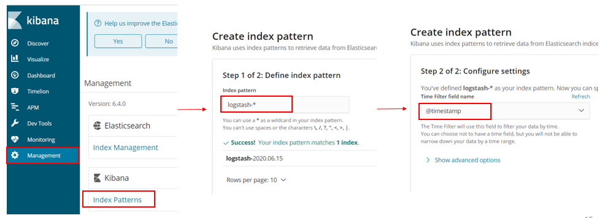

AWS 프로젝트 3주차
===

1. EFK Stack
2. ElasticSearch
3. Kibana
4. Fluentd
5. Kibana 로그 시각화
---
## 1. EFK Stack
### EFK Stack란?
1. ElasticSearch + Fluentd + Kibana
2. Fluentd는 쿠버네티스와 같은 CNCF 스택으로 마이크로서비스 모니터링 시스템 구축 시 많이 사용된다 > ELK Stack(ElasticSearch+Logstash+Kibana) 조합에서 Logstash 대신 Fluentd를 사용한 것
3. ElasticSearch : Fluentd로 부터 받은 데이터를 검색 및 집계하여 필요한 정보 획득
4. Fluentd : 데이터(로그)를 수집해서 Elasticsearch로 전달하며 Daemonset으로 구성
    - Daemonset : Pod가 각 노드에 하나씩만 배포되게 하는 Pod 관리 컨트롤러
5. Kibana : Elasticsearch의 검색 능력을 통해 데이터 시각화 및 모니터링    
</img><br/>

---
## 2. ElasticSearch
### ElasticSearch란?
1. Apache Lucene 기반의 확장성이 좋은 JAVA 오픈소스 분산 검색엔진
2. 많은 양의 데이터를 보관하고 실시간으로 저장, 검색, 분석이 가능
3. 특징
    - 테이블과 스키마 대신 문서 형식(JSON)으로 저장
    - 쿼리 속도가 매우 빠르고 확장성이 좋다.
    - 에러에 대한 높은 탄성을 가지고 있고 데이터 타입에 유현하다.
4. 설치 방법
    - JDK8이상 설치 > ElasticSearch 설치 > 설정파일 수정 > 서비스 시작
    - 쿠버네티스 이용하여 배포 시 ElasticSearch yaml 파일 작성 후 배포 > 이 방식으로 할 것이다.

---

### ElasticSearch 배포
1. Elasticsearch.yaml 파일 작성

```
apiVersion: apps/v1
kind: Deployment
metadata:
    name: elasticsearch
    labels:
        app: elasticsearch
spec:
    replicas: 1
    selector:
        matchLabels:
            app: elasticsearch
    template:
        metadata:
            app: elasticsearch
        spec:
            containers:
            - name: elasticsearch
              image: elastic/elasticsearch:6.4.0
              env:
              - name: discovery.type
                value: "single-node"
              ports:
              - containerPort: 9200
              - containerPort: 9300

---
apiVersion: v1
kind: Service
metadata:
    labels:
        app: elasticsearch
    name: elasticsearch-svc
    namespace: default
spec:
    ports:
    - name: elasticsearch-rest
      nodePort: 30920
      port: 9200
      protocol: TCP
      targetPort: 9200
    - name: elasticsearch-nodecom
      nodePort: 30930
      port: 9300
      protocol: TCP
      targetPort: 9300
    selector:
        app: elasticsearch
    type: NodePort
```

```
kubectl apply -f elasticsearch.yaml
kubectl get svc
```

2. ELB 리스너에 추가 (리스너 : 정의한 프로토콜과 포트를 사용하여 연결 요청을 확인하는 프로세스)
    EC2 > 로드밸런서 > 리스너 > 편집   
</img></br>

3. ELB의 9200 포트로 외부 접근 허용을 위해 보안 그룹 인바운드 규칙 추가
    EC2 > 로드밸런서 > 보안 그룹 아이디 확인/선택 > 보안 그룹 > 인바운드 규칙 편집   
</img></br>

> 로드밸런서의 9200 포트 오픈 >    
외부에서 로드밸런서의 9200포트로 접근 >    
리스너 편집으로 9200번 포트로 들어온 트래픽을 WorkerNode 30920 포트로 전달 (nodePort) >    
WorkerNode로 전달된 트래픽은 9200포트를 통해 Service로 전달 (port) >    
Service에 의해 Pod의 9200 포트로 전달 (targetPort)

로드밸런서의 EXTERNAL-IP:9200 으로 접속하여 확인    
</img></br>

---
---
## 3. Kibana
### Kibana란?
1. Elasticsearch에서 색인된 데이터를 검색하고 시각화하는 오픈소스 툴
2. 설치방법
    - kibana 설치 > 설정 파일 수정 > 서비스 시작
    - 쿠버네티스 이용하여 배포시 kibana yaml 파일 작성 후 배포 > 이 방식으로 할 것이다.

---
### Kibana 배포
1. kibana.yaml 파일 작성

```
apiVersion: apps/v1
kind: Deployment
metadata:
    name: kibana
    labels:
        app: kibana
spec:
    replicas: 1
    selector:
        matchLabels:
            app: kibana
    template:
        matadata:
            labels:
                app: kibana
        spec:
            containers:
            - name: kibana
              image: elastic/kibana:6.4.0
              env:
              - name: SERVER_NAME
                value: "kibana.kubernetes.example.com"
              - name: ELASTICSEARCH_URL
                value: "https://elasticsearch-svc.default.svc.cluster.local:9200"
              ports:
              - containerPort: 5601

---
apiVersion: v1
kind: Service
metadata:
    labels:
        app: kibana
    name: kibana-svc
    namespace: default
spec:
    ports:
    - nodePort: 30561
      port: 5601
      protocol: TCP
      targetPort: 5601
    selector:
        app: kibana
    type: NodePort
```

```
kubectl apply -f kibana.yaml
kubectl get svc
```

2. ELB 리스너에 추가
    - EC2 > 로드밸런서 > 리스너 > 편집   
</img></br>

3. ELB 5601 포트로 외부 접근 허용을 위해 보안 그룹 인바운드 규칙 추가
    - EC2 > 로드밸런서 > 보안 그룹 아이디 확인/선택 > 보안 그룹 > 인바운드 규칙 편집   
</img></br>

> 로드밸런서의 5601 포트 오픈 >   
외부에서 로드밸런서의 5601포트로 접근 >   
리스너 편집으로 5601번 포트로 들어온 트래픽을 WorkerNode 30561 포트로 전달 (nodePort) >   
WorkerNode로 전달된 트래픽은 5601포트를 통해 Service로 전달 (port) >   
Service에 의해 Pod의 5601 포트로 전달 (targetPort)

로드밸런서의 External-IP:5601으로 접근하여 Kibana Web 확인   
</img></br>

---
## 4. Fluentd
### Fluentd란?
1. 오픈 소스 데이터(로그) 수집기
2. 다양한 데이터 소스 (HTTP,TCP 등)로 부터 데이터를 받아올 수 있다.
3. tag, time, record(JSON)로 구성된 이벤트로 처리되며, 원하는 형태로 가공되어 다양한 목적지(ElasticSearch, S3 등)로 전달 된다.
4. 설치 방법
    - 쿠버네티스를 이용하여 fluentd yaml 작성 후 배포

### Fluentd 배포
1. fluentd.yaml 작성 후 배포

```
apiVersion: v1
kind: ServiceAccount
metadata:
    labels:
        k8s-app: fluentd
    name: fluentd
    namespace: kube-system

---
apiVersion: rbac.authorization.k8s.io/v1beta1
kind: ClusterRole
metadata:
    name: fluentd
    namespace: kube-system
rules:
    - apiGroups:
        - ""
      resources:
        - "namespaces"
        - "pods"
      verbs:
        - "list"
        - "get"
        - "watch"

---
apiVersion: rbac.authorization.k8s.io/v1beta1
kind: ClusterRoleBinding
metadata:
    name: fluentd
roleRef:
    apiGroup: rbac.authorization.k8s.io
    kind: ClusterRole
    name: fluentd
subjects:
- kind: ServiceAccount
  name: fluentd
  namespace: kube-system

---
apiVersion: apps/v1
kind: DaemonSet
metadata:
    name: fluentd
    namespace: kube-system
    labels:
        k8s-app: fluentd-logging
        version: v1
        kubernetes.io/cluster-service: "true"
spec:
    selector:
        matchLabels:
            k8s-app: fluentd-logging
    template:
        metadata:
            labels:
                k8s-app: fluentd-logging
                version: v1
                kubernetes.io/cluster-service: "true"
        spec:
            serviceAccount: fluentd
            serviceAccountName: fluentd
            tolerations:
            - key: node-role.kubernetes.io/master
              effect: NoSchedule
            containers:
            - name: fluentd
              image: fluent/fluentd-kubernetes-daemonset:v1.4.2-debian-elasticsearch-1.1
              env:
                - name: FLUENT_ELASTICSEARCH_HOST
                  value: "elasticsearch-svc.default.svc.cluster.local"
                - name: FLUENT_ELASTICSEARCH_PORT
                  value: "9200"
                - name: FLUENT_ELASTICSEARCH_SCHEME
                  value: "http"
                - name: FLUENTD_SYSTEMD_CONF
                  value: "disable"
                - name: FLUENT_UID
                  value: "0"
              resources:
                limits:
                    memory: 200Mi
                request:
                    cpu: 100m
                    memory: 200Mi
                volumeMouts:
                - name: varlog
                  mountPath: /var/log
                - name: varlibdockercontainers
                  mountPath: /var/lib/docker/containers
                  readOnly: true
            terminationGracePeriodSeconds: 30
            volumes:
            - name: varlog
              hostPath:
                path: /var/log
            - name: varlibdockercontainers
              hostPath:
                path: /var/lib/docker/containers

```

```
kubectl apply -f fluentd.yaml
```

---
## 5. Kibana 로그 시각화
### Kibana 인덱스 패턴 생성
1. 인덱스 패턴 생성
    - Management > Index Patterns > Index pattern:logstash-* > @timestamp > Create   
    </img></br>   

2. 검색필터로 설정하여 로그 확인
    - Discover > 검색 필터 설정 (nginx 확인 > nginx 배포 때 사용한 Label로 필터)   
    </img>